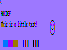
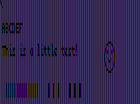
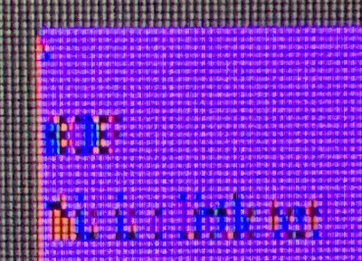

# really-small-font

an experiment with rendering bitmap fonts with subpixels rather than whole pixels, to save space at the expense of your eyes. this can generalize to monochromatic images with a "pixel" aspect ratio of 1:3.

this is inspired by ken perlin's [tiny font](http://blog.kenperlin.com/?p=6804), which led me to wonder about how extreme the idea can be taken. ken's font itself could be encoded with this project to result in 200% extra horizontal space!

## examples

note that this assumes no dpi scaling and an rgb subpixel geometry.

|                      | when the text is lit                                                                                                                                        | when the background is lit                                                                                                                                       |
| -------------------- | ----------------------------------------------------------------------------------------------------------------------------------------------------------- | ---------------------------------------------------------------------------------------------------------------------------------------------------------------- |
| output               |  |  |
| simulated zoom       |                                                                                                            |                                                                                                               |
| on my actual monitor |                                                                                                                  |                                                                                                                     |

## why purple?

the color chosen is one where each of the individual channels have equal perceptual brightness.

this might not be optimal since blue still seems pretty dark.

per-channel gamma calibration image (needs to not by dpi-scaled):

